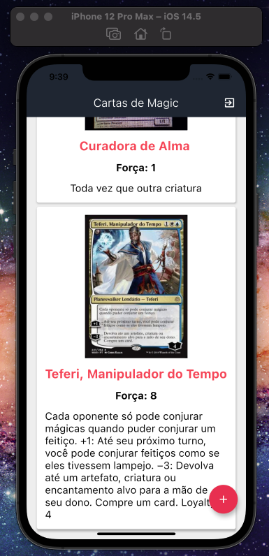
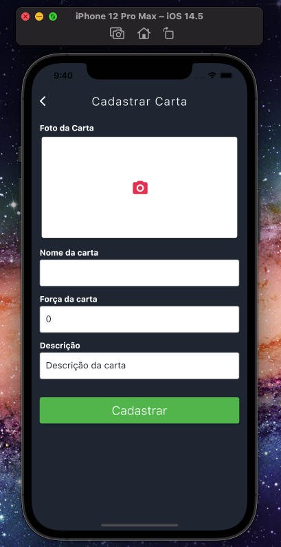

# Cartas de MAGIC

## Atividade Revisão em Grupo 23/08/2021

Seu grupo deverá criar um APP com autenticação para controle de cartas de MAGIC. O usuário poderá através de um formulário cadastrar suas cartas para deixá-las arquivadas digitalmente. Para o cadastro de cartas você deverá receber os seguintes dados em um formulário:

Nome da Carta
Descrição da Carta
Força(valor de 0 a 10)
Imagem - Você deverá permitir que o usuário fotografe a sua carta física com a câmera do celular.

Armazene as informações em uma base do firebase.

Obs.: Não é necessário realizar todo processo do CRUD, somente a autenticação e o PUSH no firebise.

## Grupos:

Bianca Santos Gonçalves Couto

Mario W. de Oliveira

Nicolle trindade Dias

Yan Ribeiro de Oliveira

[Link do Projeto](https://github.com/Yan22Oliveira/Cartas-de-Magic.git)

